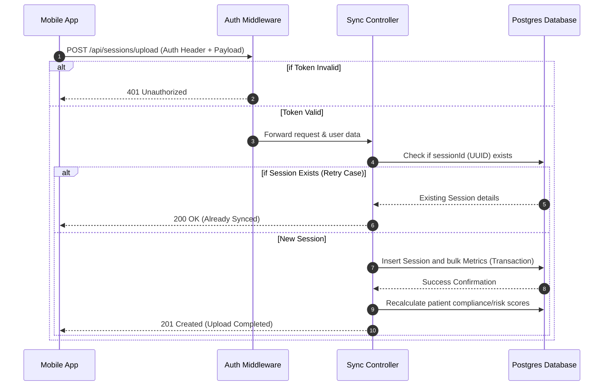

# Backend Task Checklist & Architecture Workflows

This document outlines the developer tasks, technical features, workflow logic, and execution diagrams for the **JoGait Backend** module.

---

## 1. Feature Specifications
*   **Secure Authentication**: JWT-based authorization for patients and clinicians with role-based route guards.
*   **Idempotent Session Upload**: Ensures retry requests from mobile devices do not double-write exercise logs.
*   **Plan Prescription Hub**: APIs for building exercise plans and syncing them down to patients.
*   **Automated Metrics Processor**: DB transactional procedures that calculate patient risk categories upon session upload.

---

## 2. Core Working Flow Diagram

---

## 3. Development Task List

### Phase 1: Base Environment & Auth
- [ ] Initialize Node.js & TypeScript workspace config.
- [ ] Setup database connection pooling with Prisma.
- [ ] Implement JWT login and register endpoints.
- [ ] Build token authentication middleware.

### Phase 2: Session Data Management
- [ ] Create Database migrations for `User`, `Session`, `Metric`, and `Plan` schemas.
- [ ] Code the `POST /api/sessions/upload` endpoint handler.
- [ ] Implement transaction boundary block to ensure atomic inserts.
- [ ] Build `sessionId` idempotency validations.

### Phase 3: Dashboard API Services
- [ ] Write `GET /api/patients` endpoint with triage filtering flags.
- [ ] Code `GET /api/patients/:patientId/history` for trend lines.
- [ ] Write `POST /api/plans/assign` plan prescriber endpoints.
- [ ] Code `POST /api/sessions/:sessionId/notes` clinician remark services.
